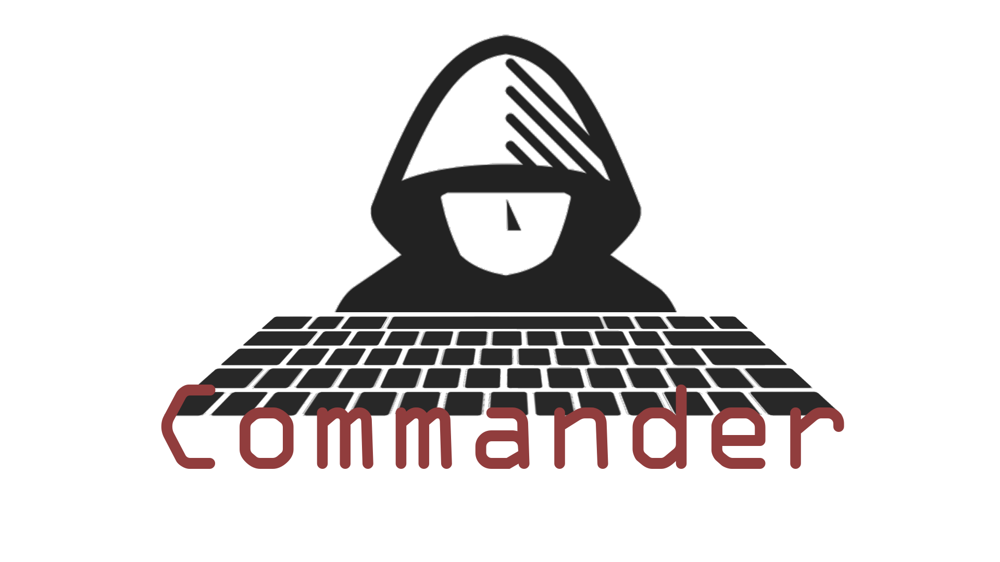

An endpoint agent framework with easy capability adding.

(currently in Alpha/development phase -- see project status at the bottom)

## Out of the box features:

### 🏗️ Modular capability adding

Capabilities can be added in the following forms:
- **On-demand job** (first to be implemented)
- **Scheduled task** (future roadmap)
- **Service** (future roadmap)

The server maintains a library of jobs, tasks, and services that can be assigned to an agent. All capabilities are stored in a zipped archive with an executable file or script, and can include many additional files and directories needed during execution.

### ⚡ Lightweight agent

By default, agents are programmed to do nothing but check in for new jobs, tasks, and services. This keeps the CPU and memory footprint low. When a job is sent to an agent, the agent will download what it needs, execute it, and delete it afterwards. Scheduled tasks and services will require agents to store files locally, and services will increase base resource utilization.

### 🔄 Self-Updating

Groups of agents can be assigned a version number that is changable by an admin. Agent version changes are detected automatically and kick off updates or roll-backs to get the agents on the specified version. Under the hood, an agent version change is just a built-in job.

### 🔒 TLS encryption

All communication between the server and the agents is done via HTTPS and WSS, but there is no need to mess with certificates yourself. Server certificate generation and deployment is automatically handled by [CAPy](https://github.com/doctormay6/CAPy), and root CA trust is automatically set up on the agents when they are deployed.

### 📑 Certificate authentication (bidirectional)

In addition to a server-side certificate for encryption, admins and agents must use a host-based certificate to be able to interact with the server. This process is also completely automated during agent deployment using the [CAPy](https://github.com/doctormay6/CAPy) microservice.

### 🔑 Admin authentication

Admin actions include creating agent installers, managing the job library, and assigning jobs to agents. Authentication is required for all admin functionality. Admin credentials are hashed with bcrypt and are used to generate temporary session tokens.

## *Project status: Alpha/development*

Right now I'm working on designing and implementing the last part of the API server -- the agent installer.

### Individual components:

🚧**API Server**: The API server is about 95% implemented and tested. Last bit relies on final Agent implemenation.

🚧**Agent**: Agent is about 10% implemented (not tested).

🚧**Admin**: Admin client is about 25% implemented (not tested). 

✔️**CAPy**: The required functionality from CAPy is fully implemented and tested.

✔️**Nginx**: Nginx configuration is 100% implemented and tested.

✔️**Docker**: Docker build and compose files are 100% implemented and tested.
